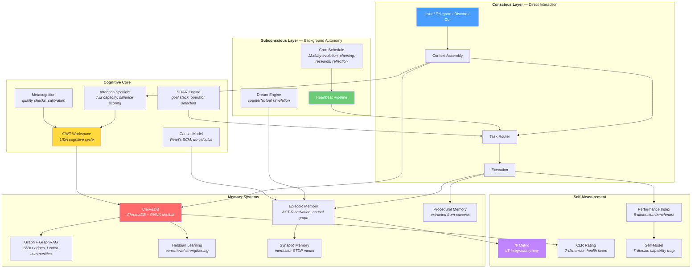
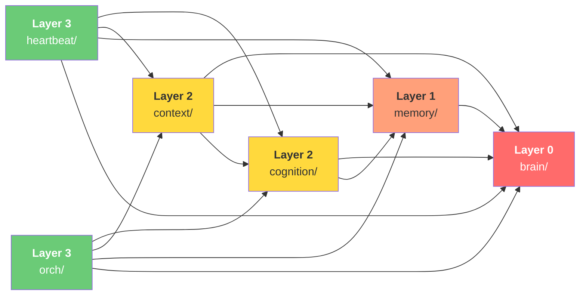
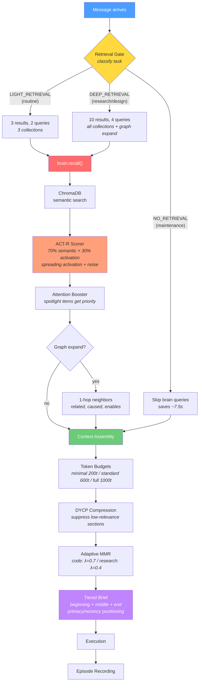
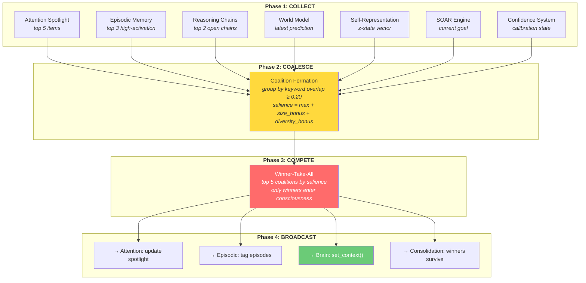
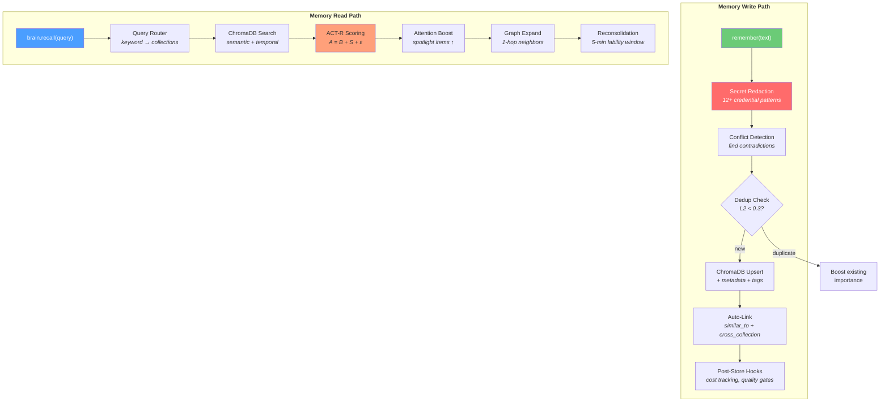
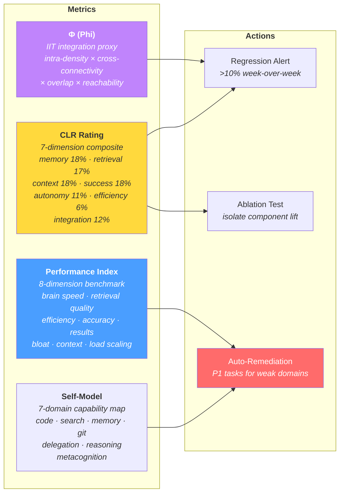
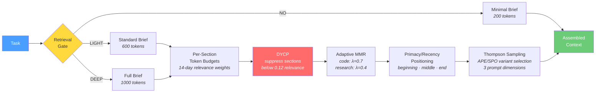

# Clarvis

[](https://github.com/GranusClarvis/clarvis/actions/workflows/ci.yml)
[](https://www.python.org/downloads/)
[](LICENSE)

**A cognitive architecture for persistent, self-improving AI agents.**

Clarvis is a 128-module Python spine that gives AI agents what they usually lack: memory that persists, attention that routes, reasoning that compounds, and a self-improvement loop that runs while you sleep. It layers onto existing agent harnesses (OpenClaw, Hermes) or runs standalone.

This is not a wrapper. It is a cognitive system grounded in computational neuroscience — Global Workspace Theory, ACT-R activation, Hebbian learning, Pearl's causal calculus, IIT-inspired integration metrics — implemented as production code, not paper demos.

[Install](#install) ·
[Cognitive Stack](#cognitive-stack) ·
[Architecture](#architecture) ·
[Memory System](#memory-system) ·
[Pipelines](#how-a-request-flows) ·
[CLI](#cli) ·
[Docs](#documentation)

---

## The Spine

128 Python files. 14 subpackages. One coherent cognitive architecture.

```
clarvis/
├── brain/       (21 files)  Vector memory, graph, ACT-R scoring, GraphRAG, secret redaction
├── memory/      (10 files)  Episodic (ACT-R), Hebbian, procedural, synaptic, SOAR, consolidation
├── cognition/   (15 files)  GWT broadcast, LIDA cycle, attention, confidence calibration, metacognition
├── context/     (11 files)  Tiered assembly, token budgets, adaptive MMR, DYCP compression
├── metrics/     (19 files)  Phi (IIT), CLR benchmark, self-model, ablation, calibration
├── heartbeat/   (11 files)  Zero-LLM gate, hook system, episode encoding, error classification
├── orch/        (12 files)  Cost tracking, queue engine, task routing, prompt optimization
├── queue/        (4 files)  Evolution queue state machine
├── learning/     (3 files)  Meta-learning from episodes
├── wiki/         (3 files)  Knowledge graph, page model, retrieval
├── runtime/      (3 files)  Mode control, execution monitor
├── adapters/     (5 files)  OpenClaw, Hermes harness integration
└── 15 CLI modules            Unified CLI with lazy subcommand loading
```

---

## Architecture



### Layer Dependency Rules



Lower layers **never** import upper layers. Brain uses dependency inversion via hook registries — external modules register scoring, boosting, and observer hooks instead of being imported by brain.

---

## How a Request Flows

When a user sends a message, this is the path through the cognitive stack:



---

## Heartbeat Pipeline

The autonomous execution loop — runs 12x/day without user interaction:

```mermaid
flowchart LR
    subgraph "<b>Gate</b> — Zero LLM"
        G1["File fingerprinting<br/><i>QUEUE.md, digest, memory</i>"]
        G2{"Changes<br/>detected?"}
        G3["SKIP<br/><i>nothing to do</i>"]
        G1 --> G2
        G2 -->|no| G3
    end

    subgraph "<b>Preflight</b> — 10 Checks"
        P1["Attention codelets"]
        P2["Cognitive load check"]
        P3["Procedural lookup"]
        P4["Reasoning chain open"]
        P5["Confidence prediction"]
        P6["Episodic compression"]
        P7["<b>Context assembly</b><br/><i>tiered brief generation</i>"]
        P8["Retrieval gate"]
        P9["Evidence scoring"]
        P10["Queue engine update"]
    end

    subgraph "<b>Execution</b>"
        EX["Claude Code<br/>runs selected task<br/><i>600-1800s timeout</i>"]
    end

    subgraph "<b>Postflight</b> — Hook Chain"
        H1["pri 10-29<br/><i>confidence outcome<br/>reasoning chain close</i>"]
        H2["pri 30-49<br/><i>procedure extraction<br/>episodic recording</i>"]
        H3["pri 50-69<br/><i>consolidation<br/>benchmark, GWT broadcast</i>"]
        H4["pri 70-89<br/><i>digest write<br/>queue cleanup</i>"]
        H5["pri 90+<br/><i>meta-learning<br/>world model update</i>"]
    end

    G2 -->|"WAKE"| P1
    P1 --> P2 --> P3 --> P4 --> P5 --> P6 --> P7 --> P8 --> P9 --> P10
    P10 --> EX
    EX --> H1 --> H2 --> H3 --> H4 --> H5

    style G1 fill:#ffd93d,color:#333
    style EX fill:#4a9eff,color:#fff
    style H3 fill:#c084fc,color:#fff
```



---

## Cognitive Stack

### GWT + LIDA Cognitive Cycle



### Attention Spotlight

7±2 capacity system with multi-factor salience scoring:

```
score = 0.25 × importance
      + 0.20 × exp(-0.115 × age_hours)     ← exponential decay (~6h half-life)
      + 0.30 × task_relevance               ← highest weight: current task match
      + 0.10 × log(access_count + 1) / 3    ← frequency (diminishing returns)
      + 0.15 × external_boost               ← GWT broadcast winners get boosted
```

Items that win broadcast survive consolidation. Items that don't, decay and get pruned.

### Confidence Calibration

Bayesian prediction tracking with Brier score calibration. Domain-specific failure rates
on 30-day rolling windows. The system knows where it's good and where it's not —
and adjusts confidence bands accordingly.

### Metacognition

Real-time quality checking: shallow reasoning detection, circular logic flagging,
unsupported claims, excessive hedging. Session-level grading (good/adequate/shallow/poor).

### Causal Reasoning (Pearl's SCM)

All three rungs of the Ladder of Causation:
- **Association** (P(Y|X)) — observational queries
- **Intervention** (P(Y|do(X))) — "what if we change this?"
- **Counterfactual** (P(Y_x|...)) — "would this have succeeded differently?"

### Absolute Zero Reasoner

Self-play reasoning with zero external data. Deduction, abduction, induction — with Monte Carlo learnability estimation. The system generates its own training problems and improves from its own reasoning traces.

### Dream Engine

Counterfactual simulation during idle time (02:00). 7 dream templates stress-test assumptions by replaying episodes with altered conditions. Stores insights for future retrieval.

---

## Memory System

Not one memory — **five distinct memory systems**, each with different dynamics:



### Episodic Memory (ACT-R)
Full activation model: `A(i) = ln(Σ t_j^(-d_j))` with Pavlik & Anderson's spacing effect.
Episodes form a causal graph (caused, enabled, blocked, fixed, retried). Power-law forgetting.

### Hebbian Learning
Co-retrieved memories strengthen connections. EWC-inspired Fisher importance shielding
protects critical memories from catastrophic forgetting.

### Procedural Memory
Automatic extraction of reusable procedures from successful episodes.
Code template learning, composition, use tracking, and stale retirement.

### Synaptic Memory (Memristor Model)
Neural memory with bounded nonlinear conductance (PCMO transfer function).
STDP-like learning: potentiation/depression based on co-activation timing.

### Cognitive Workspace (Baddeley)
Three-tier hierarchy — active (5), working (12), dormant (30) — with task-driven
dormant reactivation. Proven-value boost for items that help across tasks.

### SOAR Architecture
Goal stack, operator proposal and conflict resolution, impasse detection
(tie, conflict, no-change, rejection), and chunking from impasse resolution.

### Brain (ClarvisDB)

The persistence layer: ChromaDB + ONNX MiniLM, fully local, no cloud dependency.
10 semantic collections, 122k+ graph edges, hierarchical Leiden community detection (GraphRAG),
three-stage memory commitment (propose → evaluate → commit), and secret redaction at the storage boundary.

---

## Self-Measurement



Clarvis doesn't just run — it **measures itself** and **fixes what degrades**.

---

## Context Assembly



---

## Autonomous Execution

### Background Cycles

```mermaid
gantt
    title Daily Autonomous Schedule (CET)
    dateFormat HH:mm
    axisFormat %H:%M

    section Evolution
    Heartbeat 1       :01:00, 30m
    Heartbeat 6       :06:00, 30m
    Heartbeat 7       :07:00, 30m
    Heartbeat 9       :09:00, 30m
    Heartbeat 11      :11:00, 30m
    Heartbeat 12      :12:00, 30m
    Heartbeat 15      :15:00, 30m
    Heartbeat 17      :17:00, 30m
    Heartbeat 19      :19:00, 30m
    Heartbeat 20      :20:00, 30m
    Heartbeat 22      :22:00, 30m
    Heartbeat 23      :23:00, 30m

    section Cognitive
    Morning Planning  :08:00, 30m
    Research AM       :10:00, 45m
    Deep Analysis     :13:00, 45m
    Implementation    :14:00, 45m
    Research PM       :16:00, 45m
    Assessment        :18:00, 30m
    Reflection        :21:00, 30m

    section Maintenance
    Dream Engine      :02:45, 15m
    Graph Maintenance :04:00, 60m
    ChromaDB Vacuum   :05:00, 15m
    Brain Eval        :06:05, 15m
```



### Obligation Tracking

Durable promise enforcement. Standing instructions checked hourly to weekly.
3+ consecutive violations auto-escalate to the evolution queue.

### Cognitive Load Homeostasis

Load measurement (queue depth, failure rate, cron timing, capability degradation).
Tasks get deferred under high load. The system protects itself from overcommitting.

---

## Install

```bash
git clone git@github.com:GranusClarvis/clarvis.git
cd clarvis
bash scripts/install.sh
```

The guided installer supports 7 profiles: standalone, OpenClaw, Hermes, fullstack, local, minimal, docker.

```bash
# Standalone (recommended for most users)
bash scripts/install.sh --profile standalone

# Verify
python3 -m clarvis brain health
python3 -m clarvis demo
```

For the full install guide, profiles, and validation criteria, see [docs/INSTALL.md](docs/INSTALL.md).

---

## CLI

```bash
python3 -m clarvis <command>
```

| Command | Purpose |
|---|---|
| `brain health` | Memory system health report |
| `brain search "query"` | Semantic retrieval across all collections |
| `brain seed` | Populate initial memories on fresh install |
| `heartbeat gate` | Zero-LLM wake/skip decision |
| `heartbeat run` | Full autonomous action cycle |
| `bench run` | 8-dimension performance benchmark |
| `metrics phi` | Integrated information (IIT) proxy metric |
| `mode show` | Current operating mode (GE / Architecture / Passive) |
| `queue status` | Evolution queue summary |
| `demo` | End-to-end self-test |

---

## Theoretical Foundations

| Feature | Theory | Reference |
|---------|--------|-----------|
| Workspace broadcast | Global Workspace Theory | Franklin et al. (2014) |
| Cognitive cycle | LIDA Architecture | Franklin & team |
| Episodic activation | ACT-R | Anderson & Lebiere (1998) |
| Spacing effect | Spacing Effect | Pavlik & Anderson (2005) |
| Memory strengthening | Hebbian + A-Mem | Xu et al. (2025) |
| Catastrophic forgetting protection | EWC | Kirkpatrick et al. (2017) |
| Cognitive workspace | Baddeley model | Agarwal et al. (2025) |
| Goal management | SOAR | Laird (2012) |
| Causal reasoning | Structural Causal Models | Pearl (2009) |
| Self-play reasoning | Absolute Zero | Zhao et al. (2025) |
| Community detection | GraphRAG | Microsoft (2024) |
| Consciousness proxy | IIT (Phi) | Tononi |
| Metacognition | Quality monitoring | Flavell (1979) |
| Confidence calibration | Brier score | Brier (1950) |

---

## Documentation

- [Install Guide](docs/INSTALL.md) — profiles, setup, validation criteria, Hermes notes
- [Support Matrix](docs/SUPPORT_MATRIX.md) — what works, what's experimental, known blockers
- [Architecture](docs/ARCHITECTURE.md) — technical architecture and package layout
- [Runbook](docs/RUNBOOK.md) — operational commands and troubleshooting
- [OpenClaw Guide](docs/USER_GUIDE_OPENCLAW.md) — day-to-day ops on OpenClaw
- [Contributing](docs/CONTRIBUTING.md) — code structure, imports, testing

---

## Contributing

```bash
git clone git@github.com:GranusClarvis/clarvis.git
cd clarvis
bash scripts/infra/setup.sh --dev --verify
python3 -m pytest -m "not slow"
```

See [docs/CONTRIBUTING.md](docs/CONTRIBUTING.md).

---

## License

MIT — see [LICENSE](LICENSE).
