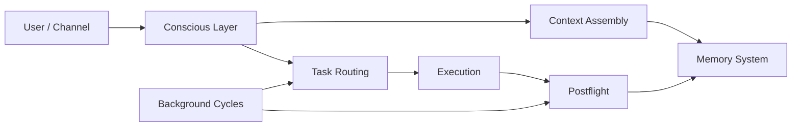
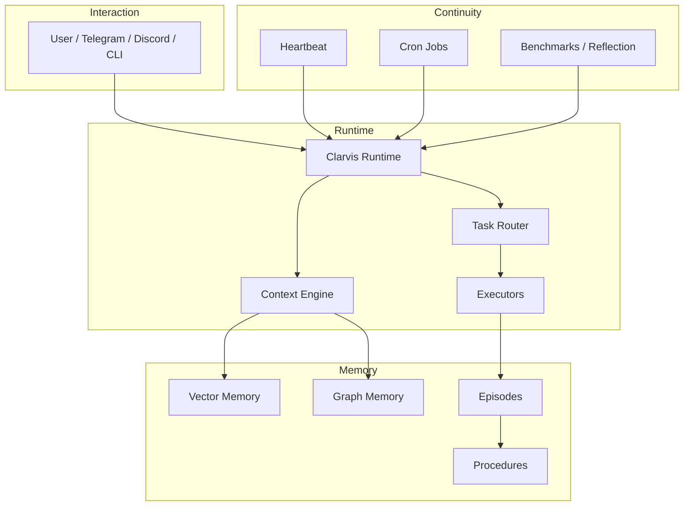

# Clarvis

[](https://github.com/GranusClarvis/clarvis/actions/workflows/ci.yml)
[](https://www.python.org/downloads/)
[](LICENSE)

**Clarvis — the Astral Machine Intelligence.**

Clarvis is an autonomous AI system with **persistent local memory**, **background execution**, and a **self-improvement loop**.
It is built for continuity: not just answering once, but remembering, adapting, and operating over time.

[Install](#install) ·
[How it Works](#how-clarvis-works) ·
[Why Clarvis](#why-clarvis) ·
[Architecture](#architecture) ·
[CLI](#cli) ·
[Docs](#documentation)

---

## Why Clarvis

Most agent shells are session-bound.
They start, respond, and disappear.

Clarvis is designed to **persist**.
It keeps a local memory system, runs scheduled background work, measures its own performance, and uses what it learned yesterday to work better today.

### What Clarvis does

- stores and recalls knowledge with a **local vector + graph memory system**
- runs **background execution loops** for planning, reflection, research, and maintenance
- tracks episodes, procedures, and outcomes across time
- assembles context dynamically instead of stuffing everything into the prompt
- measures itself with benchmarks, calibration, and internal metrics
- can operate as both a **chat-facing system** and a **long-running autonomous process**

### Where Clarvis is stronger than a typical agent wrapper

| Dimension | Typical agent shell | Clarvis |
|---|---|---|
| Memory | In-context only | Persistent local memory across sessions |
| Runtime | User-triggered | User-triggered + scheduled background execution |
| Learning | Usually forgotten | Episodes, procedures, retrieval, self-review |
| Evaluation | Ad hoc | Built-in metrics, calibration, benchmark loops |
| Context | Manual or bloated | Routed, pruned, ranked, budgeted |
| Operation style | One-shot | Continuous |

---

## Install

### Fast path

```bash
git clone git@github.com:GranusClarvis/clarvis.git
cd clarvis
bash scripts/install.sh
```

The guided installer supports multiple profiles, including standalone and OpenClaw-based setups.

### Minimal standalone install

```bash
bash scripts/install.sh --profile standalone
```

### Manual install

```bash
pip install -e ".[brain]"
bash scripts/verify_install.sh
```

### Sanity check

```bash
python3 -m clarvis brain health
python3 -m clarvis demo
```

For the full install guide and profile matrix, see [docs/INSTALL.md](docs/INSTALL.md).
For validation criteria and tested install paths, see [docs/INSTALL_MATRIX.md](docs/INSTALL_MATRIX.md).

---

## What you get

### 1. Persistent memory

Clarvis uses a fully local memory stack:
- semantic vector retrieval
- graph relationships
- episodic records of what happened
- procedural extraction from successful work

Example:

```python
from clarvis.brain import search, remember, capture

remember("Deploy using the verified staging checklist", importance=0.9)
results = search("staging deploy checklist")
capture("The Hermes install required direct run_agent.py instead of the wrapper CLI")
```

### 2. Autonomous execution

Clarvis does not wait passively forever.
It can run recurring background cycles for:
- planning
- research
- reflection
- maintenance
- benchmark and health checks

This makes it suitable for a long-running system, not just a single chat window.

### 3. Context assembly that doesn’t collapse under its own weight

Clarvis uses retrieval gates, ranking, compression, and token budgeting to decide what belongs in context.
That means less prompt sludge, better continuity, and fewer expensive hallucinations caused by indiscriminate stuffing.

### 4. Self-measurement

Clarvis includes internal evaluation systems for:
- calibration
- benchmark performance
- architecture health
- self-modeling
- integrated-information-style proxy metrics

---

## How Clarvis works

At a high level:



### In plain English

1. A request arrives.
2. Clarvis decides whether memory is needed.
3. Relevant context is retrieved, ranked, and trimmed.
4. The task is executed directly or routed to a stronger executor.
5. The result is recorded as an episode.
6. Useful procedures and learnings are retained for future use.
7. Background cycles continue improving the system when no one is speaking to it.

---

## Architecture

Clarvis has two operating layers:

### Conscious layer
Handles direct interaction:
- chat
- task execution
- context assembly
- routing
- immediate response generation

### Background layer
Handles long-running continuity:
- scheduled work
- evolution queue execution
- reflection
- research ingestion
- maintenance and benchmarking

### Core subsystems

- **Brain** — vector memory + graph memory
- **Memory** — episodic, procedural, working memory paths
- **Cognition** — attention, confidence, reasoning, relevance
- **Context** — retrieval, pruning, ranking, token budgets
- **Heartbeat / Cron** — recurring autonomous execution
- **Metrics** — calibration, performance, self-model, architecture health

---

## Visual model



---

## CLI

```bash
python3 -m clarvis <command>
```

### Common commands

| Command | Purpose |
|---|---|
| `brain health` | inspect memory system health |
| `brain search "query"` | semantic retrieval |
| `brain stats` | quick memory stats |
| `heartbeat gate` | zero-LLM wake/skip check |
| `heartbeat run` | full action cycle |
| `queue show` | inspect evolution queue |
| `bench run` | full benchmark run |
| `bench clr` | architecture benchmark |
| `metrics phi` | integrated-information-style proxy metric |
| `demo` | quick end-to-end demo |

---

## Public-facing positioning

Clarvis is not a generic chatbot skin.
It is not a thin wrapper around one model call.
It is a persistent machine intelligence system designed for long-horizon operation.

That makes it useful when you care about:
- continuity
- memory
- self-improvement
- background execution
- inspectable internal structure

---

## Current scope

Clarvis is strongest today as:
- a local-first autonomous agent system
- a persistent memory architecture
- a long-running operator / research / execution system
- a base for higher-order public deployment surfaces

It is intentionally opinionated. It prefers continuity over minimalism and structure over novelty theatre.

---

## Documentation

- [Install Guide](docs/INSTALL.md)
- [Install Matrix](docs/INSTALL_MATRIX.md) — validation criteria for fresh installs
- [Support Matrix](docs/SUPPORT_MATRIX.md)
- [Architecture](docs/ARCHITECTURE.md)
- [Launch Packet](docs/LAUNCH_PACKET.md)
- [Gap Audit](docs/OPEN_SOURCE_GAP_AUDIT.md)
- [Roadmap](ROADMAP.md)

---

## Contributing

```bash
git clone git@github.com:GranusClarvis/clarvis.git
cd clarvis
bash scripts/setup.sh --dev --verify
python3 -m pytest -m "not slow"
```

See [CONTRIBUTING.md](CONTRIBUTING.md).

---

## License

MIT — see [LICENSE](LICENSE).
