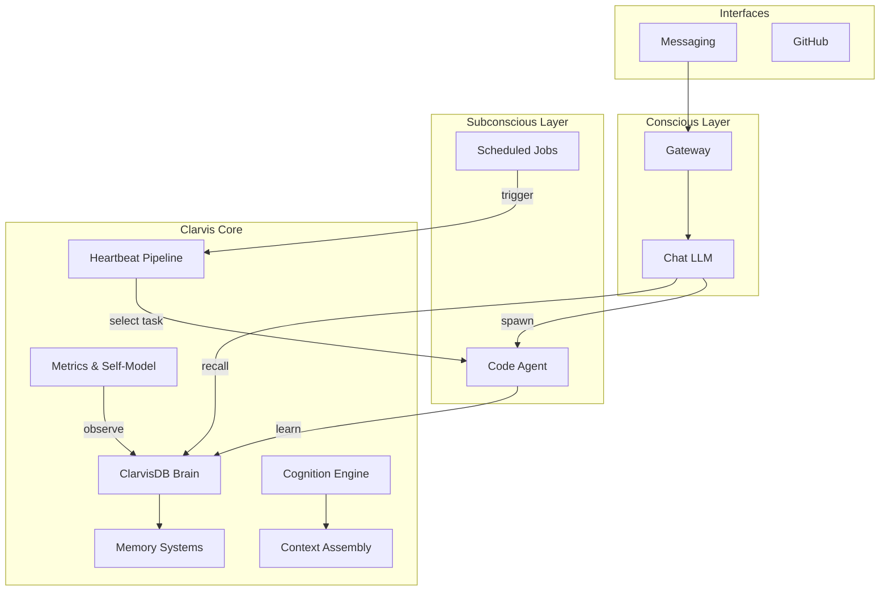
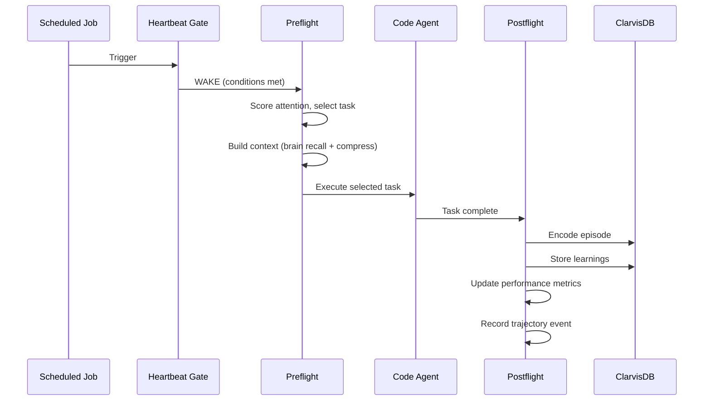

# Clarvis

[](https://github.com/GranusClarvis/clarvis/actions/workflows/ci.yml)
[](https://www.python.org/downloads/)
[](LICENSE)

> Autonomous evolving AI agent — dual-layer cognitive architecture with persistent memory, self-directed task execution, and continuous self-improvement.

Clarvis is a cognitive agent system that operates autonomously on a dedicated host. It has a **conscious layer** for direct interaction (chat) and a **subconscious layer** that works in the background — researching, planning, building, and reflecting on its own performance. All memory is local and persistent. The system continuously learns from its own execution history.

---

## Installation

```bash
# Clone the repository
git clone https://github.com/GranusClarvis/clarvis.git
cd clarvis

# Install core package (editable)
pip install -e .

# Install with brain (vector memory) support
pip install -e ".[brain]"

# Install sub-packages
pip install -e packages/clarvis-db
pip install -e packages/clarvis-cost
pip install -e packages/clarvis-reasoning
```

**Requirements:** Python 3.10+, pip. Brain features need `chromadb` and `onnxruntime` (installed automatically with `.[brain]`).

---

## Quick Start

```bash
# Brain operations
python3 -m clarvis brain health           # Full health report
python3 -m clarvis brain stats            # Quick stats
python3 -m clarvis brain search "query"   # Search memories

# Operating mode
python3 -m clarvis mode show              # Current mode
python3 -m clarvis mode set passive       # Switch to user-directed

# Heartbeat (autonomous execution cycle)
python3 -m clarvis heartbeat gate         # Pre-check (wake/skip)
python3 -m clarvis heartbeat run          # Full preflight + task selection

# Benchmarks
python3 -m clarvis bench run              # Full performance benchmark
python3 -m clarvis bench clr              # CLR benchmark
python3 -m clarvis bench trajectory       # Trajectory evaluation
```

### Python API

```python
from clarvis.brain import search, remember, capture

results = search("deployment procedures")     # Semantic search across all collections
remember("key insight", importance=0.9)       # Store with importance weight
capture("learned something new")              # Auto-classify and store
```

---

## Architecture Overview



**Conscious layer** — handles direct conversation, reads digests of subconscious work, and spawns the code agent for complex tasks.

**Subconscious layer** — runs 20+ scheduled jobs daily: autonomous evolution, research ingestion, reflection, maintenance, and performance benchmarking. Results surface through a shared memory digest.

---

## Core Components

### ClarvisDB Brain
Hybrid vector-graph memory system. ChromaDB for semantic search + relationship graph for structured knowledge. 10 specialized collections, ONNX MiniLM embeddings, fully local. No external API calls.

### Heartbeat Pipeline
The core action cycle: **gate** (should we wake?) → **preflight** (score attention, select task, build context) → **execute** (code agent runs the task) → **postflight** (encode episode, update metrics, store learnings).

### Memory Systems
- **Episodic** — temporal recall of past task executions with confidence tracking
- **Procedural** — extracted procedures and step-by-step patterns
- **Working** — session-level buffer with task-driven reactivation (Baddeley-inspired)
- **Hebbian** — connection strengthening between co-activated memories

### Cognition
- **Attention (GWT)** — Global Workspace Theory salience scoring for task selection
- **Retrieval Gate** — 3-tier routing (NO / LIGHT / DEEP) to skip unnecessary memory queries
- **Self-Model** — 7 capability domains with calibrated confidence
- **Performance Index** — 8-dimension composite score tracking operational health
- **Operating Modes** — GE (full autonomy) / Architecture (improve-only) / Passive (user-directed)

---

## Project Structure

```
clarvis/                     # Core Python package (spine)
├── brain/                   # ClarvisDB: ChromaDB + ONNX vector memory + graph
├── memory/                  # Episodic, procedural, working, Hebbian memory
├── cognition/               # GWT attention, confidence, somatic markers
├── context/                 # Context assembly + MMR compression
├── metrics/                 # Performance index, trajectory eval, CLR benchmark
├── heartbeat/               # Gate → preflight → execute → postflight pipeline
├── runtime/                 # Operating mode control-plane
├── orch/                    # Task routing and selection
├── adapters/                # Host extraction boundary (adapter pattern)
└── cli.py                   # Unified CLI: python3 -m clarvis <cmd>

scripts/                     # Operational scripts (cron, heartbeat, cognitive)
packages/                    # Installable packages (clarvis-db, clarvis-cost, clarvis-reasoning)
tests/                       # Smoke, integration, and unit tests
docs/                        # Architecture, runbook, gap audit
```

---

## How It Learns



Each execution cycle produces an **episode** — a structured record of what was attempted, what happened, and what was learned. Episodes feed back into future task selection (attention scoring) and context assembly (retrieval).

---

## Metrics & Observability

| Dimension | What It Measures |
|-----------|------------------|
| Memory System | ChromaDB + graph health, query speed |
| Autonomous Execution | Task completion rate, trajectory quality |
| Context Relevance | Brief quality, retrieval alignment |
| Reasoning Chains | Causal reasoning quality |
| Code Generation | Test pass rate, syntax health |
| Self-Reflection | Meta-cognitive assessment quality |
| Calibration | Prediction accuracy |
| Performance Index | Composite 0.0–1.0 score across all dimensions |

---

## Testing

```bash
# Run all tests
python3 -m pytest

# Spine module tests
python3 -m pytest clarvis/tests/ -v

# Package tests (clarvis-db)
python3 -m pytest packages/clarvis-db/tests/ -v

# Open-source readiness smoke tests
python3 -m pytest tests/test_open_source_smoke.py -v
```

CI runs automatically on push and PR to `main` via GitHub Actions.

---

## Known Limitations

- **Single-host design** — built for a dedicated server with systemd, not containerized
- **CPU-only embeddings** — ONNX MiniLM on CPU (~7.5s per full brain query across 10 collections)
- **Path defaults** — some scripts default to a fixed workspace path (override with `CLARVIS_WORKSPACE` env var)
- **Test fragmentation** — tests spread across `tests/`, `clarvis/tests/`, `packages/*/tests/`

See [`docs/OPEN_SOURCE_GAP_AUDIT.md`](docs/OPEN_SOURCE_GAP_AUDIT.md) for a detailed gap analysis.

---

## Documentation

| Document | Purpose |
|----------|---------|
| [`docs/ARCHITECTURE.md`](docs/ARCHITECTURE.md) | Detailed architecture and package layout |
| [`docs/LAUNCH_PACKET.md`](docs/LAUNCH_PACKET.md) | Quick orientation for new contributors |
| [`docs/OPEN_SOURCE_GAP_AUDIT.md`](docs/OPEN_SOURCE_GAP_AUDIT.md) | Gap analysis for public release readiness |
| [`ROADMAP.md`](ROADMAP.md) | 6-phase evolution plan |

---

## Contributing

Contributions are welcome. To get started:

1. Fork the repo and create a feature branch
2. Install in development mode: `pip install -e ".[brain]"`
3. Run tests: `python3 -m pytest`
4. Open a PR against `main`

Please keep changes focused — one feature or fix per PR.

---

## License

MIT — see [pyproject.toml](pyproject.toml) for details.

---

*Last updated: 2026-03-18*
