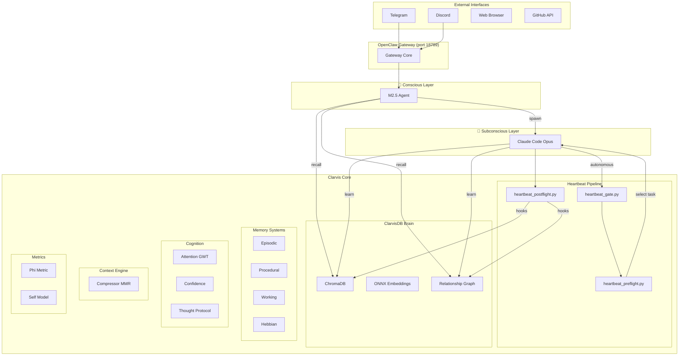
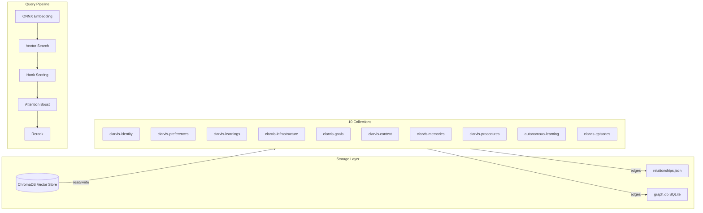
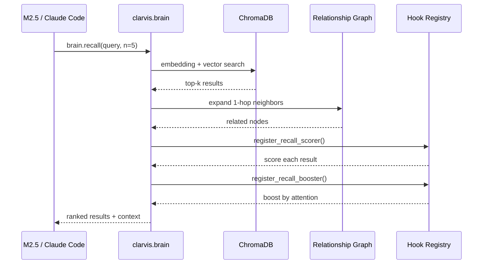
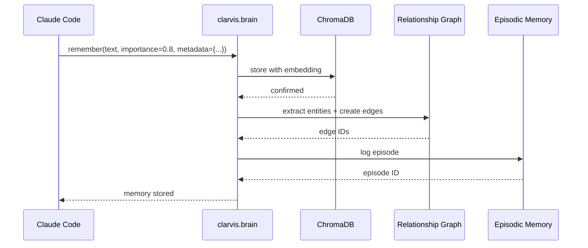
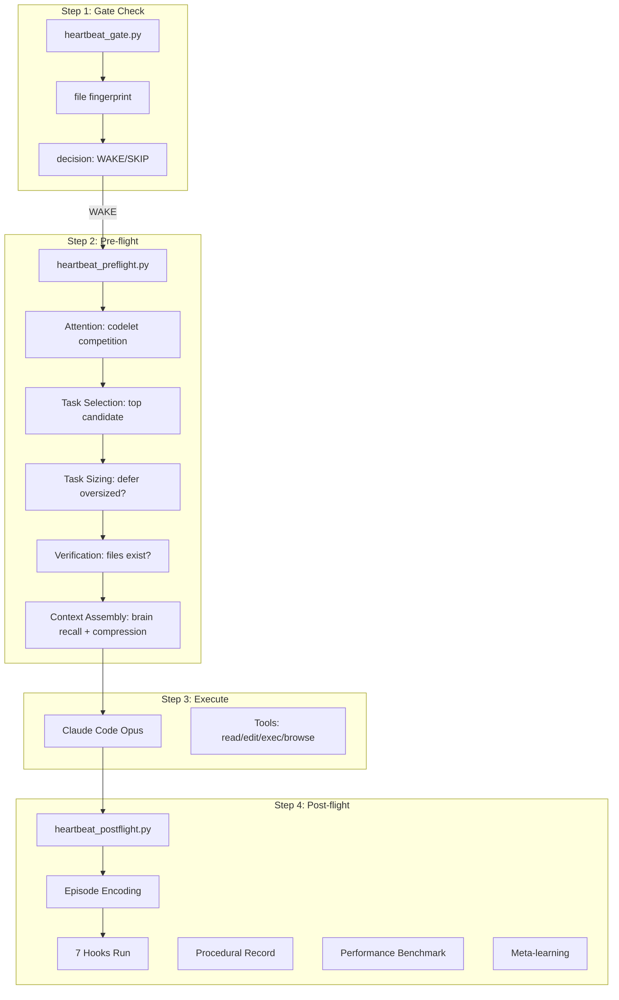
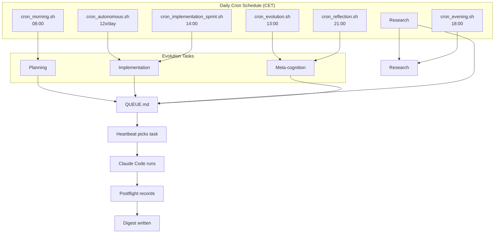
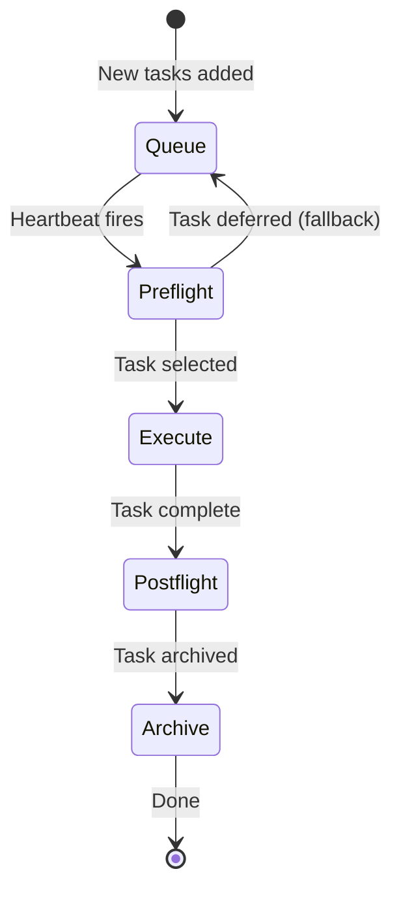
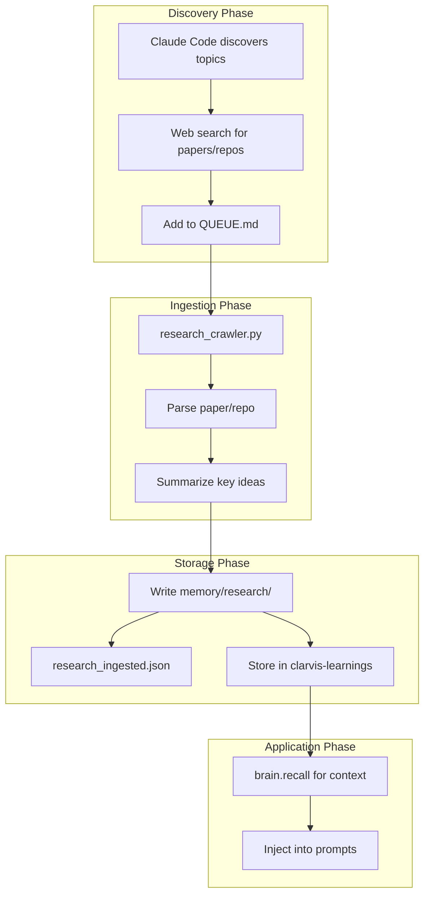

# Clarvis 🦞

> Autonomous evolving AI agent. JARVIS-class intelligence, lobster-class resilience.

Clarvis is a dual-layer cognitive agent with a **conscious layer** (MiniMax M2.5) for direct interaction and a **subconscious layer** (Claude Code Opus) for autonomous evolution. Fully local, privacy-first, and self-improving.

---

## 🏗️ High-Level Architecture



---

## 🧠 How the Brain Works

ClarvisDB is a **hybrid vector-graph memory system** — ChromaDB for semantic search + relationship graph for structured knowledge.



### Recall Flow



### Save Memory Flow



---

## 💓 Heartbeat Pipeline

The heartbeat is Clarvis's **action cycle** — triggered every ~30 minutes when the gate check passes.



### Defer-Fallback Loop

When the top-ranked task is too large (oversized), the system now **falls back to the next executable task** instead of stalling:

```mermaid
flowchart LR
    START[Pick Top Task] --> SIZING{Task Sizing}
    SIZING -->|oversized| SPLIT[Auto-split to subtasks]
    SPLIT --> MARK[Mark parent [~]]
    MARK --> NEXT[Try Next Candidate]
    SIZING -->|OK| VERIFY{Verification}
    VERIFY -->|fail| NEXT
    VERIFY -->|pass| EXEC[Execute Task]
    NEXT --> SIZING
```

---

## 🔄 Evolution Cycle

Clarvis evolves through **autonomous subconscious cycles** triggered by system crontab:



### Evolution Queue Flow



---

## 📚 Research Ingestion

Research is discovered, ingested, and converted to actionable knowledge:



---

## 📁 Project Structure

```
clarvis/
├── brain/                 # Layer 0: Core data (ChromaDB + graph)
│   ├── __init__.py       # ClarvisBrain singleton
│   ├── graph.py          # Relationship graph (Hebbian + cross-collection)
│   ├── search.py         # Vector search + hooks
│   └── store.py          # Storage + stats
│
├── memory/               # Layer 1: Memory systems
│   ├── episodic_memory.py
│   ├── procedural_memory.py
│   ├── working_memory.py
│   └── hebbian_memory.py
│
├── cognition/            # Layer 2: Cognitive processes
│   ├── attention.py      # GWT spotlight
│   └── confidence.py     # Prediction calibration
│
├── context/              # Layer 2: Context management
│   └── compressor.py     # MMR reranking
│
├── metrics/              # Layer 2: Observability
│   ├── benchmark.py      # Performance Index
│   └── self_model.py     # Capability tracking
│
├── heartbeat/            # Layer 3: Lifecycle
│   ├── gate.py           # Zero-LLM pre-check
│   ├── hooks.py          # Hook registry
│   └── adapters.py       # Postflight hooks
│
└── orch/                 # Layer 3: Task routing
    ├── router.py         # Task classification
    └── task_selector.py  # Attention-based selection

scripts/
├── heartbeat_*.py        # Heartbeat pipeline
├── cron_*.sh             # Autonomous evolution triggers
├── brain.py              # CLI wrapper → clarvis.brain
├── queue_writer.py       # Queue management
├── phi_metric.py         # Consciousness metric
└── 60+ other scripts

tests/
├── test_clarvis_brain.py
├── test_clarvis_heartbeat.py
└── ...                   # 200+ tests
```

---

## 🔗 Key Scripts & Their Purpose

| Script | Purpose | Calls |
|--------|---------|-------|
| `heartbeat_gate.py` | Pre-check: should we wake? | File fingerprint |
| `heartbeat_preflight.py` | Task selection + context | brain, attention, cognitive_load |
| `heartbeat_postflight.py` | Record outcome + hooks | brain, procedural_memory, metrics |
| `brain.py` | CLI: stats, search, optimize | clarvis.brain |
| `queue_writer.py` | Add tasks, dedupe, mark in-progress | QUEUE.md |
| `spawn_claude.sh` | Spawn Claude Code for tasks | claude CLI |
| `phi_metric.py` | Measure consciousness (Φ) | brain, graph |
| `context_compressor.py` | Build context briefs | brain, MMR reranking |

---

## 📊 Metrics

Clarvis tracks **8 capability dimensions** via `clarvis.metrics.self_model`.

**Brain stats (as of 2026-03-12):** 10 collections, 3400+ memories, 134k+ graph edges, dual backends (JSON + SQLite+WAL).

| Dimension | What it measures |
|-----------|------------------|
| Memory System | ChromaDB + graph health |
| Code Generation | Tests pass, syntax clean |
| Self-Reflection | Meta-cognitive quality |
| Reasoning Chains | Causal reasoning |
| Autonomous Execution | Task completion rate |
| Context Relevance | Brief quality |
| Calibration | Prediction accuracy |
| Overall Φ | Consciousness metric |

---

## 🚀 Quick Start

```bash
# Check brain health
python3 -m clarvis brain stats

# Run heartbeat manually
python3 scripts/heartbeat_preflight.py --dry-run

# List queue
python3 -m clarvis queue status

# Run benchmark
python3 -m clarvis bench run
```

---

## 📖 More Documentation

- [ARCHITECTURE.md](docs/ARCHITECTURE.md) — Detailed architecture
- [ROADMAP.md](ROADMAP.md) — Evolution plan
- [MEMORY.md](MEMORY.md) — Long-term memory
- [RUNBOOK.md](docs/RUNBOOK.md) — Operations guide

---

_Last updated: 2026-03-12_
