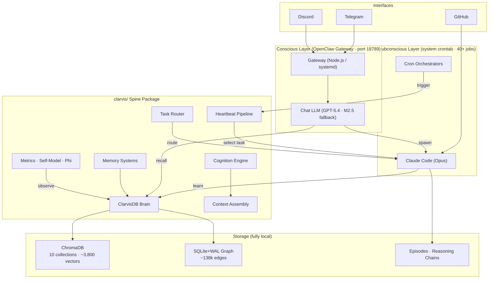

# Clarvis (self)

[](https://github.com/GranusClarvis/clarvis/actions/workflows/ci.yml) [](https://www.python.org/downloads/) [](LICENSE)

## Repository Structure

```
  .github/
  clarvis/
  config/
  docs/
  knowledge/
  scripts/
  seed/
  skills/
  tests/
  website/
  .dockerignore
  .env.example
  .gitignore
  .gitleaks.toml
  AGENTS.md
  AGENTS.md.example
  CONTRIBUTING.md
  Dockerfile
  HEARTBEAT.md
  IDENTITY.md
```

**Files**: 511 | **Top-level dirs**: 10 | **Languages**: Python, Shell, JavaScript

## Notable Files

- `.github/workflows/ci.yml`
- `CONTRIBUTING.md`
- `Dockerfile`
- `LICENSE`
- `docker-compose.yml`
- `pyproject.toml`
- `skills/brave-search/package.json`

## README (truncated)

# Clarvis

[](https://github.com/GranusClarvis/clarvis/actions/workflows/ci.yml)
[](https://www.python.org/downloads/)
[](LICENSE)

> Autonomous evolving AI agent — dual-layer cognitive architecture with persistent memory, self-directed task execution, and continuous self-improvement.

**[Website](https://granusclarvis.github.io/clarvis/)** &middot; **[Architecture](https://granusclarvis.github.io/clarvis/architecture.html)** &middot; **[Benchmarks](https://granusclarvis.github.io/clarvis/benchmarks.html)** &middot; **[Roadmap](https://granusclarvis.github.io/clarvis/roadmap.html)**

Clarvis is a cognitive agent system that operates autonomously on a dedicated host. It has a **conscious layer** for direct interaction (chat) and a **subconscious layer** that works in the background — researching, planning, building, and reflecting on its own performance. All memory is local and persistent. The system continuously learns from its own execution history.

---

## Installation

```bash
git clone https://github.com/GranusClarvis/clarvis.git
cd clarvis

# Guided installer (recommended) — interactive profile selection
bash scripts/install.sh

# Or non-interactive with a specific profile
bash scripts/install.sh --profile standalone      # Python + CLI + brain
bash scripts/install.sh --profile standalone --dev # + ruff + pytest
bash scripts/install.sh --profile docker           # Containerized dev/test
```

The guided installer checks prerequisites, installs packages in the correct dependency order, creates a `.env` from a profile template, and runs verification automatically.

**Requirements:** Python 3.10+, pip. Brain features need `chromadb` and `onnxruntime` (installed automatically). On a fresh clone, the brain starts empty — memories accumulate through operation.

### Installation Profiles

| Profile | What You Get | Extra Requirements |
|---------|-------------|-------------------|
| **Standalone** | Python packages + CLI + brain | None |
| **OpenClaw** | + chat gateway (Telegram/Discord) | Node.js 18+ |
| **Full Stack** | + cron schedule + systemd service | Linux, Claude Code CLI |
| **Docker** | Containerized dev/test | Docker + Compose |

See [docs/INSTALL.md](docs/INSTALL.md) for the full walkthrough, profile comparison matrix, and troubleshooting.

### Manual Install (advanced)

```bash
pip install -e ".[brain]"           # or ".[all]" for brain + dev tools
bash scripts/verify_install.sh      # verify everything works
```

### Extras

| Extra | What It Installs | When You Need It |
|-------|-----------------|------------------|
| `.[brain]` | ChromaDB + ONNX Runtime | Vector memory (most users) |
| `.[dev]` | Ruff + pytest | Contributing / development |
| `.[all]` | Brain + dev tools | Full development environment |

---

## Quick Start

```bash
# Brain operations
python3 -m clarvis brain health           # Full health report
python3 -m clarvis brain stats            # Quick stats
python3 -m clarvis brain search "query"   # Search memories

# Operating mode
python3 -m clarvis mode show              # Current mode
python3 -m clarvis mode set passive       # Switch to user-directed

# Heartbeat (autonomous execution cycle)
python3 -m clarvis heartbeat gate         # Pre-check (wake/skip)
python3 -m clarvis heartbeat run          # Full preflight + task selection

# Benchmarks
python3 -m clarvis bench run              # Full performance benchmark
python3 -m clarvis bench clr              # CLR benchmark
python3 -m clarvis bench trajectory       # Trajectory evaluation

# Other CLI commands
python3 -m clarvis cognition              # Context relevance, attention weights
python3 -m clarvis cost                   # Cost tracking and budget monitoring
python3 -m clarvis cron                   # Cron job inspection and execution
python3 -m clarvis metrics                # Self-model, phi, performance index
python3 -m clarvis queue                  # Evolution queue management
```

### Demo Walkthrough

```bash
# One-command demo — stores, searches, recalls, checks CLI health:
python3 -m clarvis demo

# Or step by step:
python3 -m clarvis brain health         # 1. Verify brain (starts empty on fresh clone — OK)
python3 -c "from clarvis.brain import remember; print(remember('Hello from Clarvis', importance=0.8))"  # 2. Store
python3 -m clarvis brain search "Hello from Clarvis" --n 3   # 3. Recall
python3 -m clarvis heartbeat gate       # 4. Heartbeat gate
```

### Docker Quickstart

```bash
docker compose run clarvis              # runs the demo
docker compose run clarvis clarvis brain health
docker compose run clarvis pytest -m "not slow"
docker compose run clarvis bash         # interactive shell
```

### Python API

```python
from clarvis.brain import search, remember, capture

results = search("deployment procedures")     # Semantic search across all collections
remember("key insight", importance=0.9)       # Store with importance weight
capture("learned something new")              # Auto-classify and store
```

---

## Architecture Overview



**Conscious layer** — handles direct conversation via Telegram/Discord, reads digests of subconscious work, and spawns Claude Code for complex tasks.

**Subconscious layer** — runs 40+ scheduled jobs: autonomous evolution (12x/day), research (2x/day), morning planning, evolution analysis, implementation sprints, evening assessment, reflection, maintenance, and benchmarking. Results surface through `memory/cron/digest.md`.

---

## Core Components

### ClarvisDB Brain

Hybrid vector-graph memory system. ChromaDB for semantic search, SQLite+WAL relationship graph for structured knowledge. ONNX MiniLM L6 v2 embeddings, fully local — no external API calls.

```mermaid
flowchart LR
    subgraph Input
        Q["Query / Memory"]
    end

    subgraph VectorStore["ChromaDB (10 collections)"]
        direction TB
        ID["identity (189)"]
        LR2["learnings (1,067)"]
        EP["episodes (350)"]
        MM["memories (450)"]
        PR["procedures (187)"]
        AL["autonomous-learning (292)"]
        OT["context · goals ·\npreferences · infrastructure"]
    end

    subgraph GraphStore["SQLite+WAL Graph"]
        direction TB
        ND["Nodes"]
        ED["Edges (~138k)"]
        IDX["Indexed lookups\n(from_id · to_id · type)"]
    end

    subgraph Retrieval
        EMB["ONNX MiniLM\nembeddings"]
        ROUTE["Collection Router\n(pattern-based)"]
        RANK["MMR Re-ranking"]
    end

    Q --> EMB --> ROUTE
    ROUTE --> VectorStore
    VectorStore --> RANK
    Q -

## Open Questions

- What are the main architectural decisions and trade-offs?
- How does this relate to Clarvis's architecture or goals?
- Are there reusable patterns or libraries worth adopting?
